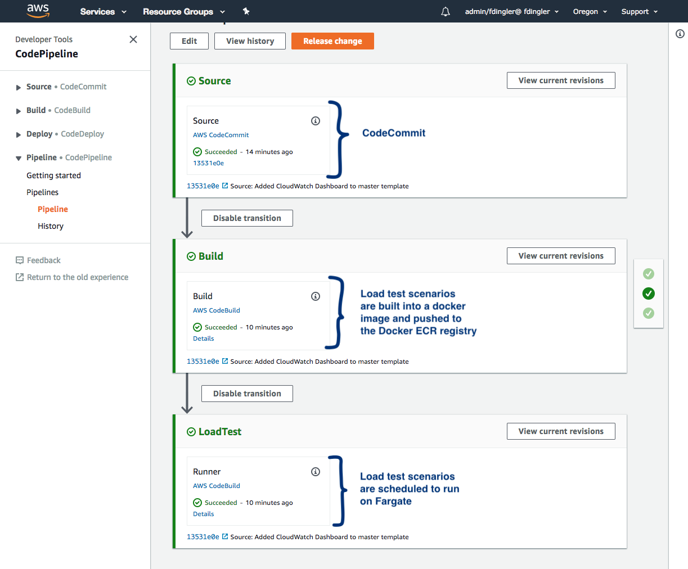
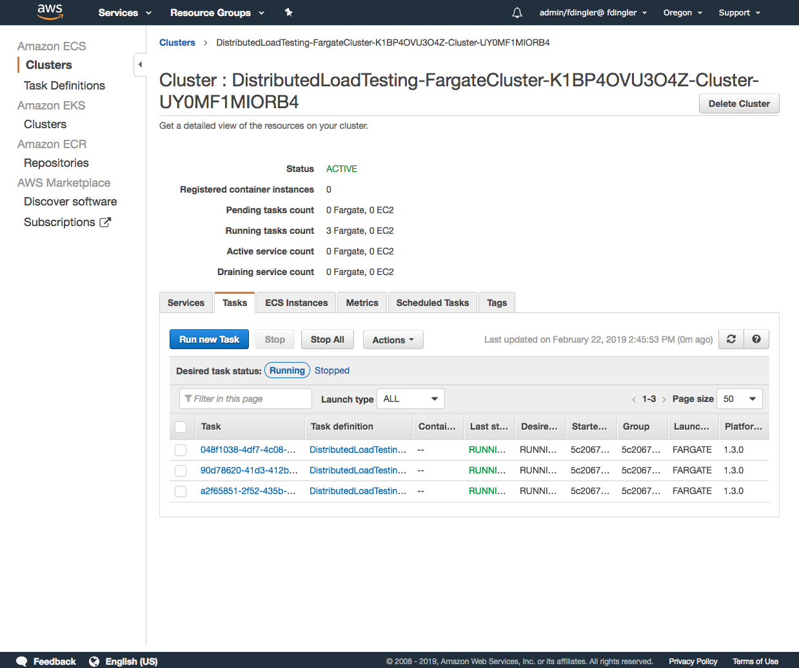
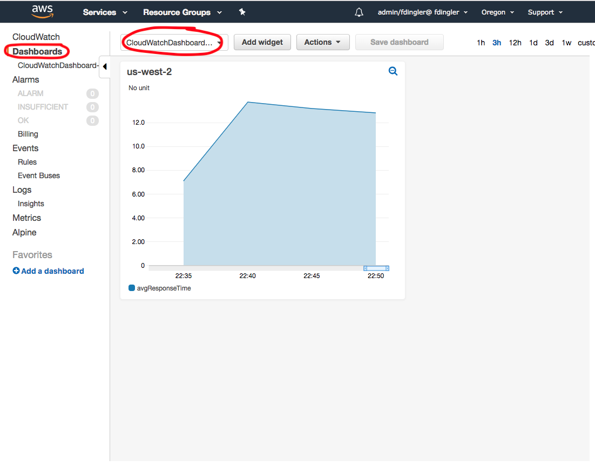
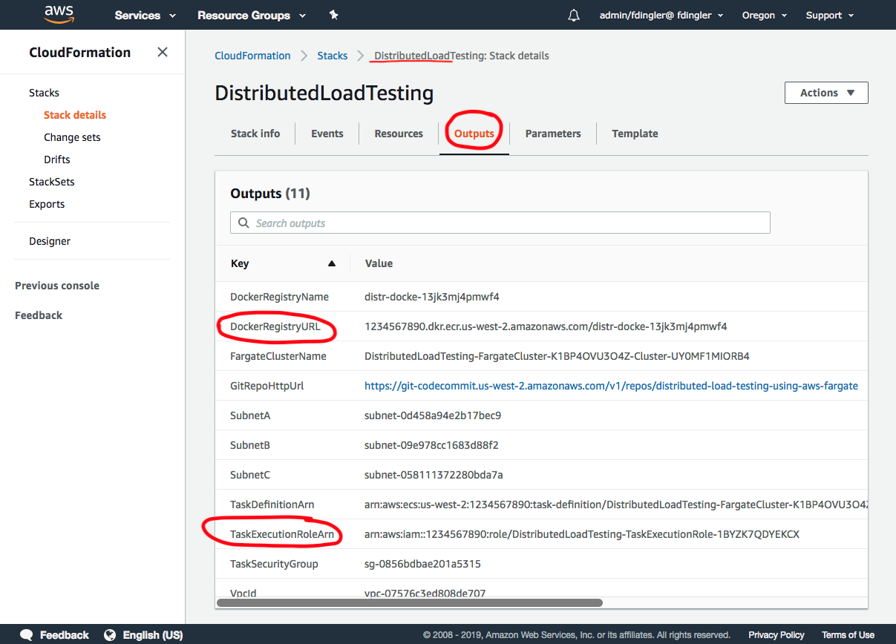
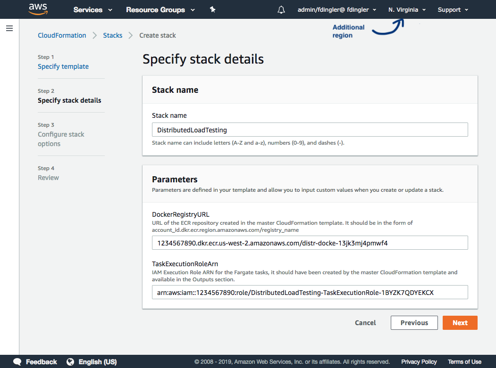
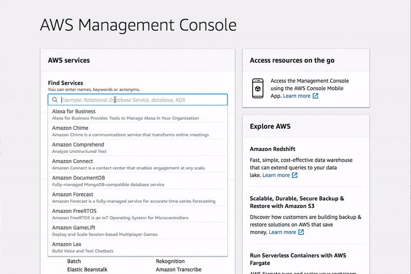
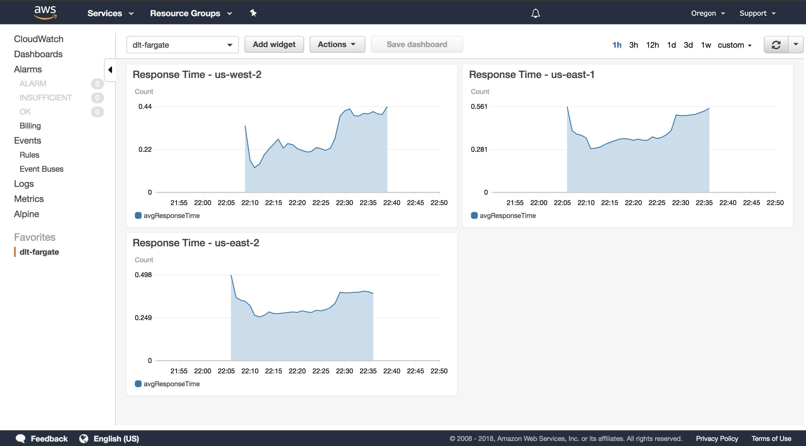

## [NEW] We launched as an official AWS Solution!

The last few months we have been working hard on making this project better and we are happy to announce that v1.0 is now available to be deployed as an official AWS Solution: [https://aws.amazon.com/solutions/distributed-load-testing-on-aws](https://aws.amazon.com/solutions/distributed-load-testing-on-aws).

The solution offers a polished version of this project with proper documentation and a User Interface (Console) where you can run and manage your load test scenarios. The solution is also open source, so you can fork it, customize it or even contribute back if you are interested! GitHub repository: [https://github.com/awslabs/distributed-load-testing-on-aws](https://github.com/awslabs/distributed-load-testing-on-aws).

The instructions below will continue to work but our development efforts will be focused on the new release.

## [OLD] Distributed Load Testing Using Fargate [](#getting-started)  [](https://github.com/aws-samples/distributed-load-testing-using-aws-fargate)

This project launches a solution that runs Distributed Load Tests using 
[AWS Fargate](https://aws.amazon.com/fargate) and [Taurus](https://gettaurus.org). You can use it to test your 
services under high stress scenarios and understand it's behavior and scalability. 


Taurus acts as a wrapper around JMeter and allows you to generate HTTP requests in parallel simulating a 
real-world scenario. This solution shows how to run Taurus on Docker containers and deploy them to Fargate clusters
running in different AWS regions, so that you can simulate requests coming from different geographic locations into 
your service. 

**Note**: Your service (system under test) does not have to be running on AWS. You can configure this solution to hit
any HTTP endpoint as long as it's accessible through the internet. However, this solution is meant to be deployed
on an AWS account. 

## License Summary

This sample code is made available under a modified MIT license. See the LICENSE file.

## Requirements

- An AWS Account
- [Git Credentials for AWS CodeCommit](https://docs.aws.amazon.com/codecommit/latest/userguide/setting-up-gc.html)  

## Getting Started

### Step 1. Launch Solution

In this step you will launch the `master` CloudFormation stack that will create a Fargate Cluster, an ECR Docker registry, an IAM
Execution Role, a Task Definition, a CloudWatch Log Group, a Security Group, a new VPC, a CodeCommit repository, a CodePipeline 
and 2 CodeBuild projects with their associated IAM Roles. 

Region Name | Region Code | Launch
------|-----|-----
US East (N. Virginia) | us-east-1 | [](https://console.aws.amazon.com/cloudformation/home?region=us-east-1#/stacks/new?stackName=DistributedLoadTesting&templateURL=https://s3.amazonaws.com/distributed-load-testing-using-aws-fargate/templates/master.yaml)
US East (Ohio) | us-east-2 | [](https://console.aws.amazon.com/cloudformation/home?region=us-east-2#/stacks/new?stackName=DistributedLoadTesting&templateURL=https://s3.amazonaws.com/distributed-load-testing-using-aws-fargate/templates/master.yaml)
US West (Oregon) | us-west-2 | [](https://console.aws.amazon.com/cloudformation/home?region=us-west-2#/stacks/new?stackName=DistributedLoadTesting&templateURL=https://s3.amazonaws.com/distributed-load-testing-using-aws-fargate/templates/master.yaml)
EU West (Ireland) | eu-west-1 | [](https://console.aws.amazon.com/cloudformation/home?region=eu-west-1#/stacks/new?stackName=DistributedLoadTesting&templateURL=https://s3.amazonaws.com/distributed-load-testing-using-aws-fargate/templates/master.yaml)

You will notice that the CloudFormation `master` stack expands itself into 4 stacks: The master one, which takes care of 
creating resources that will be shared across regions like the ECR Registry and the CodePipeline; The VPC nested stack, 
which creates the network configuration and subnets; The Fargate nested stack which creates the cluster and task definition 
and the Pipeline nested stack that creates the CodeCommit repository and the CodeBuild projects to build and run the 
load tests in Fargate.

### Step 2. Clone this repository

```bash
git clone https://github.com/aws-samples/distributed-load-testing-using-aws-fargate.git
```

### Step 3. Modify the load test scenario

Configure your test scenario by editing the `examples/http/taurus.yml` file. The default example shown below runs a load test 
for 5 minutes with 5 concurrent requests per second against https://aws.amazon.com with a ramp-up time of 1 minute. 

```yaml
execution:
- concurrency: 5
  ramp-up: 1m
  hold-for: 5m
  scenario: aws-website-test

scenarios:
  aws-website-test:
    requests:
    - https://aws.amazon.com
```

To learn more about the syntax of this file, check the Taurus docs: https://gettaurus.org/kb/Index.

### Step 4. Push to CodeCommit

One of the resources that gets created when deploying this solution is a CodeCommit repository and a CodePipeline connected 
to it. On every commit the pipeline will run automatically, build the load test scenarios into a Docker image and push 
the image to the ECR registry and finally run the load tests into the Fargate clusters. 
 
Now, remove the current Git origin of the project because you just cloned it from Github and you want your remote origin
to be the CodeCommit repository instead.   

```bash
git remote rm origin
```

Now, set the origin to be your new CodeCommit repository. An easy way to find the repository URL is in the `Outputs` section
of the CloudFormation stack you launched on Step 1. [See the following screenshot](docs/cfn-outputs.png). The URL
should look something like this: `https://git-codecommit.us-west-2.amazonaws.com/v1/repos/distributed-load-testing-using-aws-fargate`.

```bash
git remote add origin {code_commit_repository_url}
```

Finally, push the code. 
    
```bash
git push -u origin master
```

**Note** If you get a permission denied error when pushing, you may not have configured CodeCommit credentials. Follow this
steps to get your authentication setup: [Git Credentials for AWS CodeCommit](https://docs.aws.amazon.com/codecommit/latest/userguide/setting-up-gc.html).

If the push was successful, go to CodePipeline and check how the build progresses all the way to the last step, which will
run the tests in the Fargate cluster. The pipeline should look like this:  



### Step 5. Monitor the test execution

When the last step of the pipeline has finished successfully, it means that your load tests are now running on Fargate.
Go to the ECS Console to find your Fargate cluster, click on it and you should see 3 tasks running: 

 

Finally, this solution also created a [CloudWatch Metric Filter](https://docs.aws.amazon.com/AmazonCloudWatch/latest/logs/FilterAndPatternSyntax.html)
that will capture the average response times for each HTTP request that is issued to your system under test by the
Docker tasks running on Fargate.  

What this filter is doing, is parsing the Taurus logs and assigning a variable name to each value in the log. It ignores 
all values in the log except for `avgRt` which is captured as a new metric and stored in your CloudWatch Metrics. To learn
more about how this metric filter was created, check the CloudFormation template `cloudformation/fargate-cluster.yaml`.

Go to CloudWatch and you should see a Dashboard that was created automatically for you under the Dashboards section. It
will display the metrics captured by the filter described above and display it in a nice graph: 



## Launch Additional Regions (Optional)

It may be likely that running this solution from a single AWS region is enough to load test your service. However, 
if you want to take it a step further, you can deploy Fargate clusters in multiple regions and make it a 
multi-region load test simulation. In order to do this, I created a separate CloudFormation template that launches this 
solution in additional regions. The difference between this template and the Master one is that this one does not
create the ECR Docker Registry, the CodePipeline and IAM Roles, as those resources will be shared across all your regions. 

Use the following links to launch the solution in the desired additional regions:

Additional Region | Region Code | Launch
------|-----|-----
US East (N. Virginia) | us-east-1 | [](https://console.aws.amazon.com/cloudformation/home?region=us-east-1#/stacks/new?stackName=DistributedLoadTesting&templateURL=https://s3.amazonaws.com/distributed-load-testing-using-aws-fargate/templates/additional-region.yaml)
US East (Ohio) | us-east-2 | [](https://console.aws.amazon.com/cloudformation/home?region=us-east-2#/stacks/new?stackName=DistributedLoadTesting&templateURL=https://s3.amazonaws.com/distributed-load-testing-using-aws-fargate/templates/additional-region.yaml)
US West (Oregon) | us-west-2 | [](https://console.aws.amazon.com/cloudformation/home?region=us-west-2#/stacks/new?stackName=DistributedLoadTesting&templateURL=https://s3.amazonaws.com/distributed-load-testing-using-aws-fargate/templates/additional-region.yaml)
EU West (Ireland) | eu-west-1 | [](https://console.aws.amazon.com/cloudformation/home?region=eu-west-1#/stacks/new?stackName=DistributedLoadTesting&templateURL=https://s3.amazonaws.com/distributed-load-testing-using-aws-fargate/templates/additional-region.yaml)

This stack will ask for 2 parameters: The `DockerRegistryURL` and `TaskExecutionRoleArn`. You can find the values for those
parameters in the `Outputs` section of the `Master` CloudFormation stack launched in **Step 1**. 



    

Finally, Once the stack has been completed, you need to tell CodePipeline that a new region has been configured so that
it also launches the Load Tests scenarios in this region. To do this, go back to the region where you launched the `Master`
stack and follow these steps:

1. Go to CodePipeline, then select the pipeline created by the master stack
2. Click on the `LoadTest` step to edit it.
3. Go to Edit > Environment
4. Expand the `Additional Configuration` section
5. Add 2 new environment variables to have your additional region added.

Name                 | Value
---------------------|---------------------
REGION_2             | Additional region (i.e. us-east-1)
REGION_2_STACK_NAME  | CloudFormation stack name (i.e. DistributedLoadTesting)

*Gif to help demonstrate the steps mentioned above: 



Save the changes, run the pipeline and you are done! Repeat those steps for every additional region. 

### Monitor All Regions

When you launch this solution in multiple regions, I recommend you centralize the monitoring into the same CloudWatch
Dashboard for easier visibility. In order to do this, you need to pull metrics from different regions into the Dashboard 
by [follow this steps](https://docs.aws.amazon.com/AmazonCloudWatch/latest/monitoring/cross_region_dashboard.html). Once 
configured, the multi-region Dashboard will look something like this:   



## How to Run Locally

It's a good practice to run your tests locally before pushing them to CodeCommit to make sure they run correctly in a
Docker container. To do this, build the image by issuing the following command in the root directory of this project.

```bash
docker build -t load-tests-using-fargate .
```

Then run the container locally.

```bash
docker run -it load-tests-using-fargate taurus.yml
```

If you are happy with the result, you can push the changes to the CodeCommit repository and let the pipeline 
do the rest.