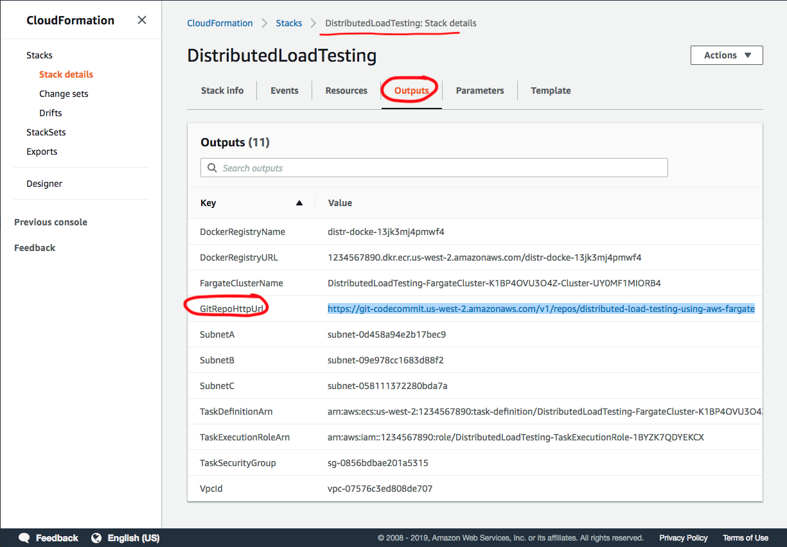

## Distributed Load Testing Using Fargate

This solution walks you through a prescriptive implementation of Distributed Load Testing using 
[AWS Fargate](https://aws.amazon.com/fargate) and [Taurus](https://gettaurus.org). You can use it to test your 
services under high stress scenarios and understand it's behavior and scalability. 


Taurus acts as a wrapper around JMeter and allows you to generate HTTP requests in parallel simulating a 
real-world scenario. This solution shows how to run Taurus on Docker containers and deploy them to Fargate clusters
running in different AWS regions, so that you can simulate requests coming from different geographic locations into 
your service. 

**Note**: Your service (system under test) does not have to be running on AWS. You can configure this solution to hit
any HTTP endpoint as long as it's accessible through the internet. However, this solution is meant to be deployed
on an AWS account. 

## License Summary

This sample code is made available under a modified MIT license. See the LICENSE file.

## Requirements

- Python 2.7+
- Docker
- Access to an AWS account
- [AWS CLI](https://docs.aws.amazon.com/cli/latest/userguide/cli-chap-install.html)

## Examples

- [Load testing a basic HTTP endpoint](https://github.com/aws-samples/distributed-load-testing-using-aws-fargate/tree/master/examples/http)
- [Load testing an Elasticsearch cluster behind a VPC](https://github.com/aws-samples/distributed-load-testing-using-aws-fargate/tree/master/examples/elasticsearch) 


## Getting Started

### 1. Launch Solution

In this step you will launch the `Master` CloudFormation stack that will create a Fargate Cluster, an ECR Docker registry, an IAM
Execution Role, a Task Definition, a CloudWatch Log Group, a Security Group and a new VPC with Public Subnets. 

Region Name | Region Code | Launch
------|-----|-----
US East (N. Virginia) | us-east-1 | [](https://console.aws.amazon.com/cloudformation/home?region=us-east-1#/stacks/new?stackName=WildRydes-Cloud9&templateURL=https://s3-us-west-2.amazonaws.com/load-testing-using-aws-fargate/artifacts/templates/master.yaml)
US East (Ohio) | us-east-2 | [](https://console.aws.amazon.com/cloudformation/home?region=us-east-2#/stacks/new?stackName=WildRydes-Cloud9&templateURL=https://s3-us-west-2.amazonaws.com/load-testing-using-aws-fargate/artifacts/templates/master.yaml)
US West (Oregon) | us-west-2 | [](https://console.aws.amazon.com/cloudformation/home?region=us-west-2#/stacks/new?stackName=WildRydes-Cloud9&templateURL=https://s3-us-west-2.amazonaws.com/load-testing-using-aws-fargate/artifacts/templates/master.yaml)

You will notice that the CloudFormation stack will expand itself into 2 additional nested stacks: The master stack takes
care of creating global resources like an ECR Registry and the IAM Execution Role. One nested stack takes care of 
creating the network (VPC) and the other creates the Fargate cluster. 

Once the three stacks have completed deployment, you need to make a note of the Output values in the master stack 
(see the following Screenshot) as you will need these values later. Go to the Outputs section of the 
master stack and save the DockerRegistryName and DockerRegistryURL values somewhere in your notes.



### 2. Clone this repository

```bash
git clone https://github.com/aws-samples/distributed-load-testing-using-aws-fargate.git
```

Switch to the latest release so you have an stable code base. 

```bash
git checkout tags/v0.2-beta
```

### 3. Modify the load test scenario

Configure your test scenario by editing the `examples/http/taurus.yml` file.  
To learn more about the syntax of this file, check the Taurus docs: https://gettaurus.org/kb/Index .

```yaml
execution:
- concurrency: 5
  ramp-up: 1m
  hold-for: 5m
  scenario: aws-website-test

scenarios:
  aws-website-test:
    requests:
    - http://aws.amazon.com
``` 

### 4. Build and push the docker image

Once you have completed your test scenario, you need to package it in a Docker image and push it to your ECR Docker registry.
To do this, you first need to authenticate against ECR. The following command assumes you have the [AWS CLI installed and configured](https://docs.aws.amazon.com/cli/latest/userguide/cli-chap-install.html). 

```bash
$(aws ecr get-login --no-include-email --region us-west-2)
```

Then, build the Docker image by running the following command from the root directory of this project. Replace 
_{DockerRegistryName}_ with the Output value you saved in Step 1.   

```bash
docker build -t {DockerRegistryName} .
```

Tag the image as `:latest`, you can choose another tag name, but for simplicity I'm doing _latest_. 

```bash
docker tag {DockerRegistryName}:latest {DockerRegistryURL}:latest
```

Test your docker container locally to verify it runs correctly.

```bash
docker run -it {DockerRegistryName} taurus.yml
```

If the docker container ran as expected, you can proceed to push the image to the registry. Unfortunately the Docker
image for Taurus is quite heavy (~900 MB), so make sure you have good internet connectivity as this push can take a 
little while. 

```bash
docker push {DockerRegistryURL}:latest
```

### 4. Run the tests in Fargate

Finally, edit the `bin/runner.py` python file to add the list of regions with its CloudFormation stack names that
you launched on the previous step. This python file will read the CloudFormation outputs and based on those parameters
will schedule the execution of the Fargate tasks.

Before running the python script, install boto3 by creating a virtual environment. Creating a virtual
environment is optional, but recommended. If you don't have virtualenv installed, you can install it with pip. 

```bash
pip install virtualenv
``` 

Create the virtual environment inside the `bin/` directory and activate it. 

```bash
cd bin/
virtualenv env
source env/bin/activate
``` 

Once inside the virtual environment, install boto3 by running:

```bash
pip install -r requirements.txt
```

And finally, when you are ready to run the Distributed Load Test, run the script.

```bash
python runner.py
```

### 5. Monitor the test execution in CloudWatch

The CloudFormation template should have created a [CloudWatch Metric Filter](https://docs.aws.amazon.com/AmazonCloudWatch/latest/logs/FilterAndPatternSyntax.html)
that will capture the average response time for each HTTP request that was issued to your system under test. You should
see something like this in the template:

```yaml
TaurusLogFilterAvgResponseTime:
  Type: AWS::Logs::MetricFilter
  Properties:
    FilterPattern: "[time, logType=INFO*, logTitle=Current*, numVu, vu, numSucc, succ, numFail, fail, avgRt, x]"
    LogGroupName: !Ref FargateTaskCloudWatchLogGroup
    MetricTransformations:
      -
        MetricValue: "$avgRt"
        MetricNamespace: "dlt-fargate/taurus"
        MetricName: "avgResponseTime"
```

What this filter is doing, is parsing the Taurus logs that match that given format and assigning a variable name to each
value in the log. We are going to ignore all values in the log except for `avgRt` which is captured as a new metric and 
stored in your CloudWatch Metrics. 

Once the filter is in place, I recommend to centralize the metrics from the different regions into a single CloudWatch
Dashboard. To pull metrics from different regions into one Dashboard [follow this steps](https://docs.aws.amazon.com/AmazonCloudWatch/latest/monitoring/cross_region_dashboard.html).
The Dashboard will look something like this:   


## Launch in Additional Regions (Optional)

It may be likely that running this solution from a single AWS region is enough to load test your application. However, 
if you want to take it a step further, you can do so by deploying Fargate clusters in multiple regions and make this a 
real distributed load test simulation. For this, I have created a separate CloudFormation template for you to launch the 
solution in additional regions. The difference between this template and the Master one, is that this one doesn't
create the ECR Docker Registry and the IAM Execution Role, as you can share these resources across all Fargate deployments. 

Use the following buttons to launch the solution in the desired additional regions:  

Additional Region | Region Code | Launch
------|-----|-----
US East (N. Virginia) | us-east-1 | [](https://console.aws.amazon.com/cloudformation/home?region=us-east-1#/stacks/new?stackName=WildRydes-Cloud9&templateURL=https://s3-us-west-2.amazonaws.com/load-testing-using-aws-fargate/artifacts/templates/additional-region.yaml)
US East (Ohio) | us-east-2 | [](https://console.aws.amazon.com/cloudformation/home?region=us-east-2#/stacks/new?stackName=WildRydes-Cloud9&templateURL=https://s3-us-west-2.amazonaws.com/load-testing-using-aws-fargate/artifacts/templates/additional-region.yaml)
US West (Oregon) | us-west-2 | [](https://console.aws.amazon.com/cloudformation/home?region=us-west-2#/stacks/new?stackName=WildRydes-Cloud9&templateURL=https://s3-us-west-2.amazonaws.com/load-testing-using-aws-fargate/artifacts/templates/additional-region.yaml)
   